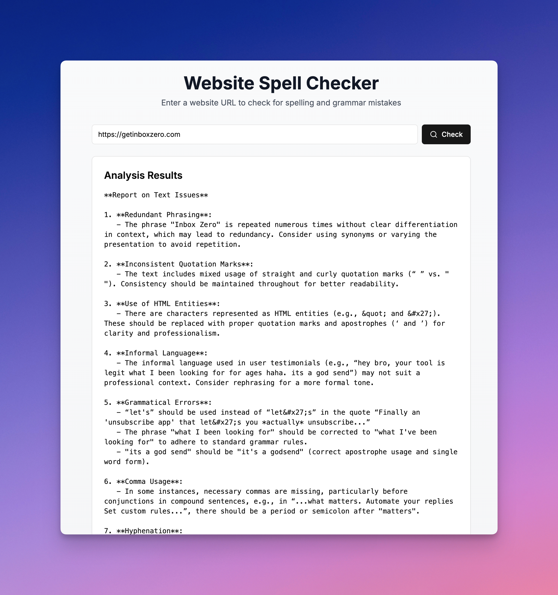

# Website Spell Checker

A fast, browser-based tool that checks spelling and grammar on any webpage.



Built with [Bolt.new](https://bolt.new) and tested using [Shortest](https://github.com/anti-work/shortest).

## Quick Start

```sh
pnpm
pnpm dev
```

## Testing

```sh
pnpm shortest
```

Test screenshots are saved to the `.shortest` folder (gitignored).
